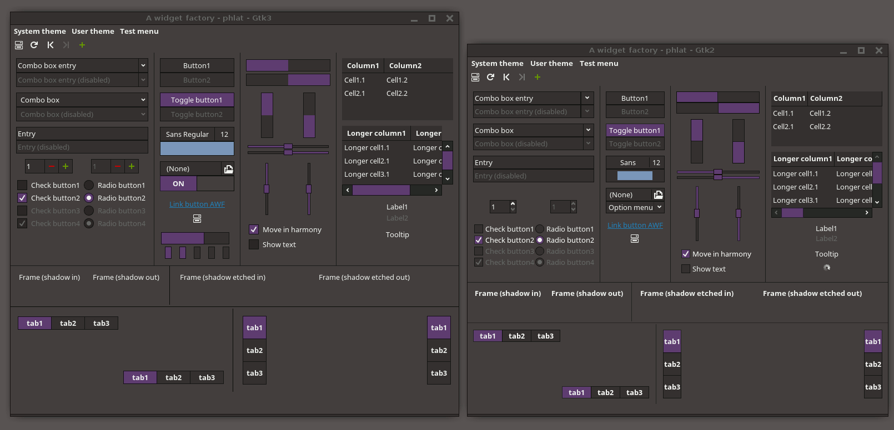

### Main Features:

* fully text/SVG based
* lightweight and fast due its simplicity
* no blue, red, green (whatever) button suggestions
* traditional style, made for the use with a mouse
* fully gtk3-nocsd compatible
* GTK2/Xfwm/Marco HiDPI theme

### Depends on: 

* GTK2 (mist, murrine and pixbuf engine with SVG support!)
* GTK3>=3.20
* Disabled GTK3 overlay scrollbars (export GTK_OVERLAY_SCROLLING=0)

### Recommends: 

* [GTK3-NOCSD](https://github.com/PCMan/gtk3-nocsd)
* Xfce(Xfwm, Xfce-notify, Xfdashboard, xfce-windowck-plugin)
* Chrome/Chromium(@GTK3)(any blink based browser will work due the internal styling of html forms)

### also included: 

* XfDashboard
* Chrome/Chromium Scrollbars
* Plank theme
* Marco/Metacity theme
* Onboard theme
* simple Firefox(@GTK3) stylish fixes (not recommend since XUL has some huge issues with dark themes)

## Install

For example to install it as user:

```
prefix=$HOME/.local
mkdir /tmp/phlat && cd /tmp/phlat
wget https://github.com/sixsixfive/phlat/archive/master.zip
unzip master.zip
mkdir -p $prefix/share/themes
mv /tmp/phlat/phlat-master $prefix/share/themes/phlat
ln -sf $prefix/share/themes/phlat/@extra/phlat-hidpi $prefix/share/themes/phlat-HiDPI
```

there are more sub themes in the @extra folder. Have a look into the [Debian postinstall](https://github.com/sixsixfive/phlat/blob/master/%40extra/PKGS/debian/postinst) or the [PKGBUILD](https://github.com/sixsixfive/phlat/blob/master/%40extra/PKGS/PKGBUILD/PKGBUILD) to get their paths.

### Packages

#### Debian

There is a [debian(>=testing) package](%40extra/PKGS/debian/phlat_1.0-1_all.deb) available that will install(and uninstall) the current master release and all main dependencies. 

```
wget https://raw.githubusercontent.com/sixsixfive/phlat/master/%40extra/PKGS/debian/phlat_1.0-1_all.deb
su -c "dpkg -i phlat_1.0-1_all.deb || apt install -f"
```

#### Manjaro / Arch

There is a [PKGBUILD](https://minhaskamal.github.io/DownGit/#/home?url=https://github.com/sixsixfive/phlat/tree/master/%40extra/PKGS/PKGBUILD) to install the current master release.

```
unzip PKGBUILD.zip && CD PKGBUILD
makepkg -is
```

#### SuSE

There is a [SuSE(=Thumbleweed) package](%40extra/PKGS/suse/phlat-1.0-1.noarch.rpm) available that will install(and uninstall) the current master release and all main dependencies. 

```
wget https://raw.githubusercontent.com/sixsixfive/phlat/master/%40extra/PKGS/suse/phlat-1.0-1.noarch.rpm
sudo zypper install --no-recommends phlat-1.0-1.noarch.rpm
```

## Optional

### Change hilight color

- If you want to change the default highlight color to something else(needs sed, tr and find!)

```
sh $prefix/share/themes/phlat/@extra/scripts/changecolor.sh
```
Remember that there is white text to display above that color(eg: on selections)

Some popular colors:

| Color | Description | Color | Description |
| :---: | :---: | :---: | :---: |
|  | Arch blue |  | Grey |
|  | Debian Red |  | Manjaro Green |
|  | Devuan Purple |  | SuSE Green |
|  | Gentoo Purple |  | Ubuntu Orange |

### Set all Xfce themes

to set the whole xfce theme you can run the following script eg:


```
sh $prefix/share/themes/phlat/@extra/scripts/setxfcetheme.sh
```

or:

```
sh $prefix/share/themes/phlat/@extra/scripts/setxfcetheme-hidpi.sh
```
